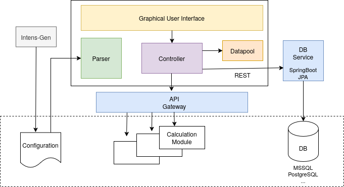

<!--
SPDX-FileCopyrightText: 2025 SEMAFOR Informatik & Energie AG, Basel

SPDX-License-Identifier: Apache-2.0
-->

# Welcome to Intens

INTENS is an integration platform that improves the engineering processes by making them more flexible, efficient and reliable.
 It is in daily operation by various renowned engineering companies since more than 10 years.

INTENS adheres to well known and established architecture patterns that lead to loosely coupled and
  highly maintainable application systems.

The INTENS core architecture implies a clear separation between the presentation and the domain layer which includes
the customer specific modules, the project data and the configuration.



INTENS based systems can be run as pure desktop applications on Linux and Windows hosts or as
cloud native application being accessible by any modern browser (Firefox, Chrome, Safari etc.)

## Build

The build process uses cmake on a Linux system. Note since intens
includes the submodules jwt-cpp and rapidjson, this repo must be cloned with
the option `--recurse-submodules`. Otherwise the submodules must be activated
after cloning with the following commands:

```
  $ git submodule init
  $ git submodule update --init --recursive
```
Build and install a debug intens:

 * configure: `cmake -DCMAKE_BUILD_TYPE=Debug -B build -S .`
 * build:     `cmake --build build -j10`
 * install:   `sudo cmake --install build`

These commands create the folder build, compile and link intens in it and
install intens to `/usr/local/intens/<version>`.

For windows (using docker image dockcross with https://mxe.cc) :
 * shared: `dockcross/build-windows-release.sh`

### Required packages

* ubuntu:
  ```
  build-essential \
  cmake \
  libxkbcommon-dev \
  libprotobuf-dev \
  protobuf-compiler \
  pkg-config \
  libssl-dev \
  libnsl-dev \
  libfl-dev \
  bison \
  gettext \
  libcurl4-openssl-dev \
  libxml2-dev \
  libxslt-dev \
  libjsoncpp-dev \
  liblog4cplus-dev \
  cppzmq-dev \
  libltdl-dev \
  qt6-base-dev \
  qt6-5compat-dev \
  qt6-svg-dev \
  qt6-networkauth-dev \
  qt6-charts-dev \
  libgtest-dev \
  zlib1g-dev \
  libxcb-xkb-dev \
  python3-mako \
  python-is-python3 \
  ```
  NOTE:
   - the minimal version of the qwt package compliant to Qt6 is 6.2 which is not yet
     available in ubuntu 24.04 LTS. It must be downloaded and installed from https://qwt.sourceforge.io

   - install gcc-multilib and tree-sitter-cli https://www.npmjs.com/package/tree-sitter-cli
     if you want to build the language-server

* gentoo:
  ```
  dev-build/cmake
  sys-devel/bison
  sys-devel/flex
  sys-devel/gettext
  dev-cpp/gtest
  dev-libs/jsoncpp
  x11-libs/qwt
  dev-qt/qtbase
  dev-qt/qtcharts
  dev-qt/qtnetworkauth
  dev-qt/qtsvg
  dev-qt/qt5compat
  net-libs/libnsl
  net-libs/cppzmq
  net-misc/curl
  dev-libs/libxml2
  dev-libs/libxslt
  dev-libs/protobuf
  dev-libs/log4cplus
  dev-util/tree-sitter-cli
  dev-python/mako
  ```
