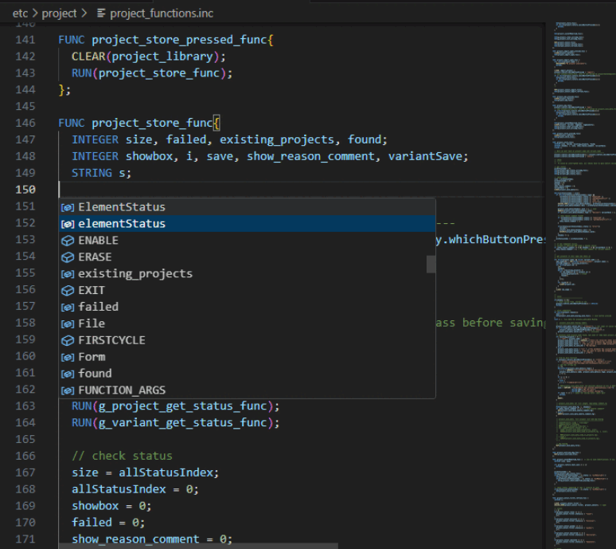

# INTENS tools for VSCode

This extension assists in developing applications made with INTENS.
It provides syntax highlighting and enables you to use the with INTENS bundled language server in VSCode.

## Requirements and settings

To use this extension you will need an install of INTENS on your computer.
If you're on Windows you will also need to set the `intens.installation` option in your settings to point to
the path of your INTENS installation.

Additionally on Windows you will need an installation of MSYS with the tools to build your application.
A list with the tools needed by a basic INTENS application can be found in the [GetingStarted](http://docs.semafor.ch/getting-started) guide.
The `intens.msys` setting will also need to point to your MSYS installation.

Lastly, for every project you will have a [Python virtual environment](https://docs.python.org/3/library/venv.html) containing its dependencies.
The language server assumes this to be `${workspaceFolder}/.venv` by default. Should you want to use a different path, please adjust the `intens.venv` setting on a per-workspace basis.

## Features

* Syntax highlighting
* Autocomplete of variable and function names
* Jump to definition
* Inline error messages
* Inline docs for builtins

## Screenshot

